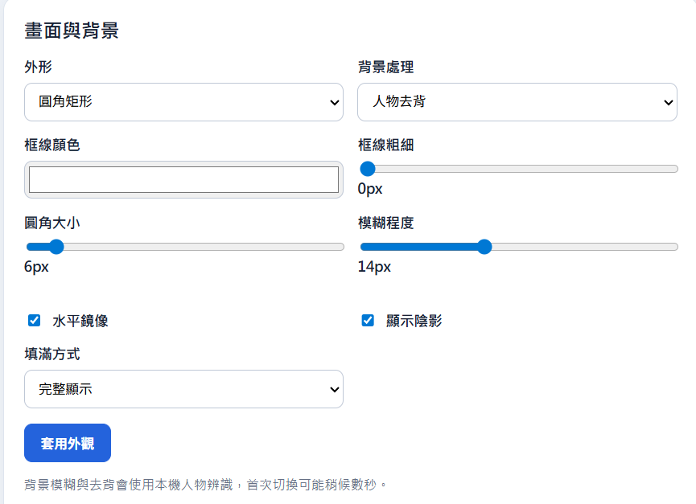

# Windows 雙攝影機浮動顯示工具

免安裝、可攜式的 Windows 雙攝影機浮動顯示工具。解壓縮後即可執行，不需要安裝驅動程式或背景服務。

## 直接下載

[下載 WebcamOverlay 0.2.7 免安裝版（EXE）](https://github.com/harmonica80/WebcamOverlay/raw/main/release/WebcamOverlay-Portable-0.2.7.exe)

## 功能總覽

### 攝影機來源

- 掃描 Windows 可用的攝影機裝置。
- 最多指定兩個不同的攝影機來源。
- 顯示一個畫面時，點擊畫面可在兩個來源間切換。
- 顯示兩個畫面時，點擊任一畫面可交換兩個來源。
- 隱藏的攝影機會釋放裝置，避免切換時互相占用。
- 攝影機中斷時顯示提示，並自動嘗試重新連線。

### 浮動視窗

- 隱藏、顯示一個、顯示兩個三種狀態。
- 無標題列，可拖曳到任意螢幕。
- 支援多螢幕與不同解析度／DPI。
- 永遠置頂顯示，切換到其他程式後仍保持顯示。
- 滑鼠滾輪平滑縮放，維持正確畫面比例。
- 記住每個視窗的位置與大小。

### 畫面外觀

- 矩形、圓角矩形、圓形外形。
- 白色、黑色、藍色及自訂框線顏色。
- 框線粗細可調整，預設 5 px。
- 圓角大小可調整，預設 20 px。
- 陰影開關。
- 圓形模式使用真正的圓形裁切，避免出現方形外露。
- 水平鏡像。

### 背景處理

- 原有背景。
- 背景模糊，可調整模糊程度。
- 人物去背，背景以透明方式顯示，可看見後方視窗。
- 背景模糊與去背使用隨程式封裝的離線人物分割模型，不需要網路。

### 快速鍵

- 循環切換隱藏／一個／兩個畫面。
- 直接隱藏、顯示一個或顯示兩個畫面。
- 交換攝影機來源。
- 快速鍵可在設定頁點選按鍵方塊後直接錄製。
- 僅使用 Windows 按鍵格式，例如 `Ctrl`、`Alt`、`Shift`、`F8`。
- 儲存時檢查格式及是否與其他程式衝突。

### 系統整合與設定

- 系統匣圖示與右鍵選單。
- 從系統匣快速開啟設定、切換顯示狀態、交換來源或結束程式。
- 外觀與攝影機設定即時套用。
- 設定保存於 `Data\settings.json`，可隨整個資料夾搬移。
- 設定頁底部提供「述文老師學習網開發」連結。
- 使用標準 PNG 應用程式與系統匣圖示。

## 設定畫面



## 使用方式

1. 下載並執行免安裝 EXE。
2. 在設定頁按「重新偵測」，選擇來源 1 與來源 2。
3. 選擇顯示狀態及外觀、背景效果。
4. 關閉設定頁後，使用浮動視窗、系統匣或自訂快速鍵操作。

## 開發與建置

```powershell
npm.cmd install
npm.cmd start
npm.cmd run build:portable
```

建置產物會放在 `release` 資料夾。專案原始碼位於 [GitHub WebcamOverlay](https://github.com/harmonica80/WebcamOverlay)。
