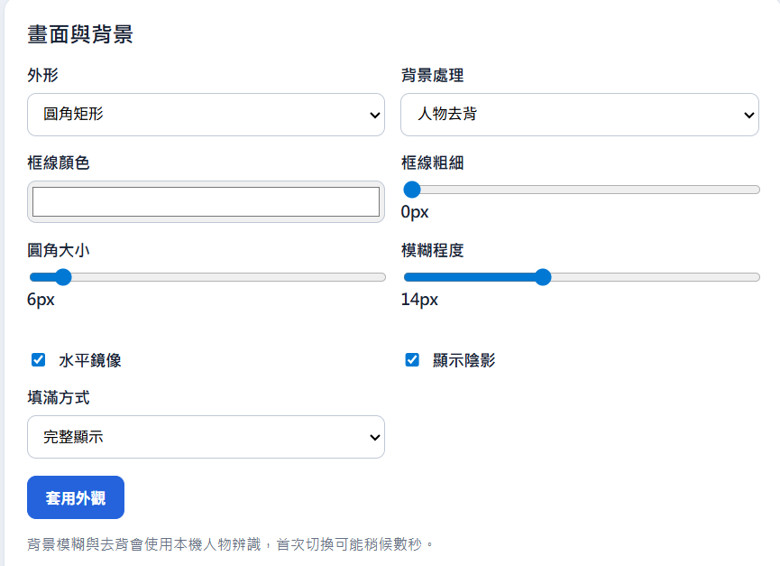

# Windows 雙攝影機浮動顯示工具

免安裝、可攜式的 Windows 雙攝影機浮動顯示工具。解壓縮後即可執行，不需要安裝驅動程式或背景服務。

## v0.2.35 設定記錄改為自行選擇

- 預設不記錄上次設定；舊版設定檔未明確開啟記錄時，也會使用預設值。
- 視窗下方可勾選「記錄設定，下次啟動時自動套用」，立即保存目前設定，後續變更自動保存。
- 取消勾選保留當次操作，清除已記錄的設定，下次啟動恢復預設值。
- 「重設為預設值」會重設目前設定並關閉記錄。
- 包含本機 v0.2.34 的 PP-MattingV2 品質模式與 ONNX 執行環境；更新下載改用 GitHub Release。

[下載 v0.2.35 免安裝版](https://github.com/harmonica80/WebcamOverlay/releases/download/v0.2.35/WebcamOverlay-Portable-0.2.35.exe)

## v0.2.33 第一階段去背改善（歷史版本）

- 「畫面與背景」新增品質／快速模式。品質模式採用通用人物分割模型，加入原始影像引導的邊緣處理與動作感知防閃爍；快速模式保留原有模型與直接遮罩合成。
- 品質模式可調整輪廓收縮、邊緣柔和與防閃爍，支援每台攝影機分別保存。初始值為 15%、25%、40%。
- 切換來源、模式或隱藏畫面會清除歷史遮罩；模型推論依序執行，過期結果不會覆蓋目前畫面。
- 本機檔案：`release/WebcamOverlay-Portable-0.2.33.exe`。保留 EXE 旁的 `Data` 資料夾即可沿用設定。
- 14 項回歸測試通過。另以 Electron 執行同一公開人物照片的移動畫面，確認兩模型、合成及切換可運作；不代表真實髮絲、雙攝影機或不同硬體的效果保證。

## 直接下載

v0.2.32 修正更換攝影機後，舊連線與自動重試干擾新來源的問題。保留既有設定；連線時隱藏視窗會釋放延遲取得的串流，使用中的攝影機中斷時會重新連線。六項受控測試通過，實體攝影機拔插與 Windows 視窗顯示仍需實機驗證。

[下載 WebcamOverlay 0.2.32 免安裝版（EXE）](https://github.com/harmonica80/WebcamOverlay/releases/download/v0.2.32/WebcamOverlay-Portable-0.2.32.exe)

## 功能總覽

### 攝影機來源

- 掃描 Windows 可用的攝影機裝置。
- 最多指定兩個不同的攝影機來源。
- 顯示一個畫面時，點擊畫面可在兩個來源間切換。
- 顯示兩個畫面時，點擊任一畫面可交換兩個來源。
- 隱藏的攝影機會釋放裝置，避免切換時互相占用。
- 攝影機中斷時顯示提示，並自動嘗試重新連線。

### 浮動視窗

- 隱藏、顯示一個、顯示兩個三種狀態。
- 無標題列，可拖曳到任意螢幕。
- 支援多螢幕與不同解析度／DPI。
- 永遠置頂顯示，切換到其他程式後仍保持顯示。
- 滑鼠滾輪平滑縮放，維持正確畫面比例。
- 勾選記錄設定後，記住每個視窗的位置與大小。

### 畫面外觀

- 矩形、圓角矩形、圓形外形。
- 白色、黑色、藍色及自訂框線顏色。
- 框線粗細可調整，預設 5 px。
- 圓角大小可調整，預設 20 px。
- 陰影開關。
- 圓形模式使用真正的圓形裁切，避免出現方形外露。
- 水平鏡像可自行開啟，預設為關閉。

### 快速排列

- 可折疊為僅顯示標題列，並能保持置頂。
- 單一攝影機提供九宮格位置，雙攝影機提供六種快速排列。
- 排列模式與攝影機選單採用視窗內選項，避免置頂狀態下選項自動關閉。

### 背景處理

- 原有背景。
- 背景模糊，可調整模糊程度。
- 人物去背，背景以透明方式顯示，可看見後方視窗。
- 背景模糊與去背使用隨程式封裝的離線人物分割模型，不需要網路。

### 快速鍵

- 循環切換隱藏／一個／兩個畫面。
- 直接隱藏、顯示一個或顯示兩個畫面。
- 交換攝影機來源。
- 快速鍵可在設定頁點選按鍵方塊後直接錄製。
- 僅使用 Windows 按鍵格式，例如 `Ctrl`、`Alt`、`Shift`、`F8`。
- 儲存時檢查格式及是否與其他程式衝突。

### 系統整合與設定

- 系統匣圖示與右鍵選單。
- 從系統匣快速開啟設定、切換顯示狀態、交換來源或結束程式。
- 外觀與攝影機設定即時套用。
- 設定保存於可攜版 EXE 旁的 `Data\settings.json`，可隨整個資料夾搬移。
- 預設不保存使用設定。勾選視窗下方的記錄選項後，攝影機來源、顯示狀態、個別外觀、快速鍵及視窗位置才會自動保存並於下次啟動套用。
- 設定視窗底部可將所有設定重設為預設值，執行前會再次確認。
- 設定頁底部提供「述文老師學習網開發」連結。
- 使用標準 PNG 應用程式與系統匣圖示。

## 設定畫面



## 使用方式

1. 下載並執行免安裝 EXE。
2. 在設定頁按「重新偵測」，選擇來源 1 與來源 2。
3. 選擇顯示狀態及外觀、背景效果。
4. 關閉設定頁後，使用浮動視窗、系統匣或自訂快速鍵操作。

## 開發與建置

```powershell
npm.cmd install
npm.cmd start
npm.cmd run build:portable
```

攝影機連線生命週期回歸測試：`node --test scripts/test-source-lifecycle.js`。此為受控非同步測試；實體裝置拔插與 Windows 浮動視窗顯示仍需實機驗證。

建置產物會放在 `release` 資料夾。專案原始碼位於 [GitHub WebcamOverlay](https://github.com/harmonica80/WebcamOverlay)。

